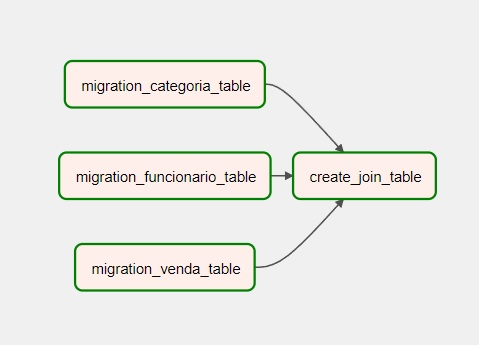

# Postgres-migrate-airflow

[](https://opensource.org/licenses/Apache-2.0)

Projeto que faz a migração de dados entre bancos de dados diariamente.  Esse modelo usa como base duas tabelas relacionais de bancos e hosts diferentes. Essa Dag copia as tabelas para um mesmo host e faz o join entre elas.



### 🛠 Tecnologias

As seguintes ferramentas foram usadas na construção do projeto:

- [Python](https://www.python.org/)
- [Docker](https://www.docker.com/)
- [Apache Airflow](https://airflow.apache.org/)

```bash
# Clone este repositório
$ git clone https://github.com/ayslanleal/dagsheets.git

# Acesse a pasta do projeto no terminal/cmd
$ docker compose up

```


